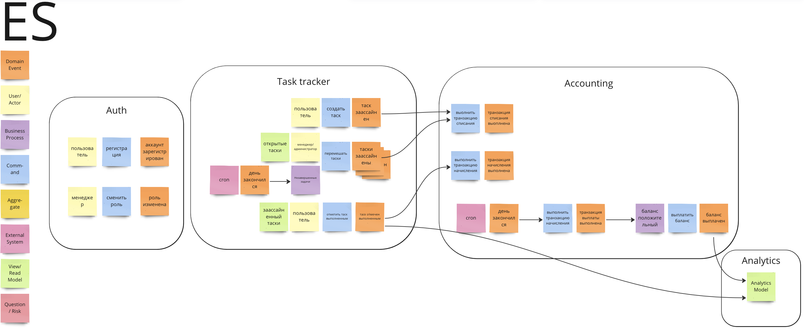
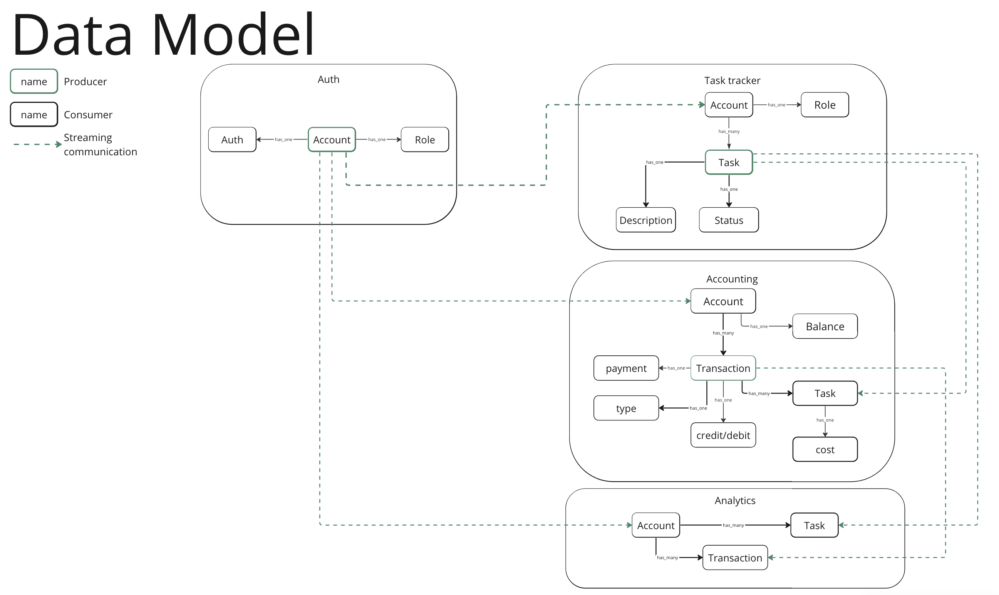

# ES, DataModel, Communications

### Events:
#### Business events:
**TaskCompleted/TaskAssigned**
* account_id
* task_id
* timestamp

#### CUD
**UserCreated/UserUpdated/UserDeleted**
* account_id
* role_id

**TaskCreated/TaskUpdated/TaskDeleted**
* account_id
* taks_id
* timestamp
* status

**TransactionCreated/TransactionUpdated**
* account_id
* transaction
