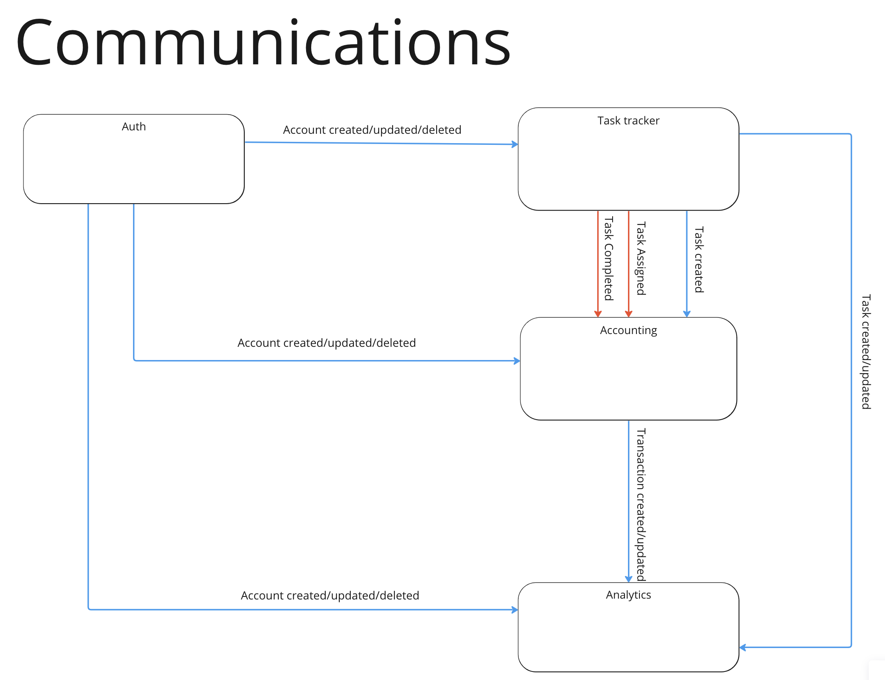

# HW1: ES, DataModel, Communications

### Events:
#### Business events:
**TaskCompleted/TaskAssigned**
* user_id
* task_id
* price
* timestamp

#### CUD
**UserCreated/UserUpdated/UserDeleted**
* user_id
* role_id

**TaskCreated/TaskUpdated/TaskDeleted**
* user_id
* taks_id
* price
    * credit
    * debit
* timestamp
* status

**AccountCreated/AccountUpdated/AccountDeleted**
* user_id
* account_id
* balance
* transaction
